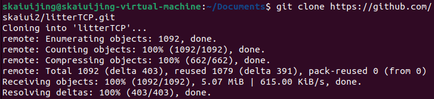
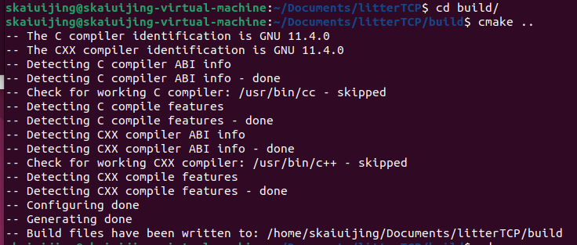
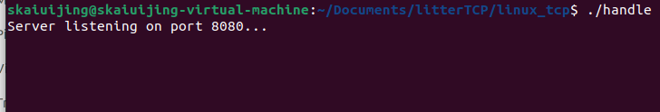
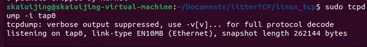
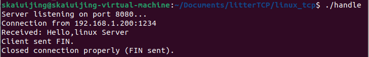
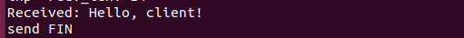
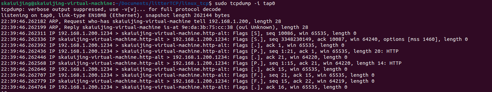

# litterTCP
A lightweight TCP/IP stack with ARP, ICMP, UDP, simplified TCP, and socket APIs—built for teaching, research, and simple communication with Linux servers and clients.

## Tutorial

English: [Let’s write a TCP/IP Stack from Scratch(Part1: Ethernet Frame I/O) | by Skaiuijing | Medium](https://medium.com/@skaiuijing/lets-write-a-tcp-ip-stack-from-scratch-part1-ethernet-frame-i-o-ef0f29555a9e)

## RUN

We will open **three terminals**:

1. One for the **Linux TCP server**
2. One for the **litterTCP client**
3. One for **tcpdump** to capture packets

## **Clone the project**

```text
git clone https://github.com/skaiui2/litterTCP.git
```



## **Create the virtual network interface**

Inside the project directory, run the script I prepared:

```text
cd litterTCP/
chmod +x do.sh
./do.sh
```

This will create a TAP interface for our TCP/IP stack.

## **Build the project with CMake**

```text
mkdir build
cd build/
cmake ..
```



Then go back to the project root:

```text
cd ..
```

## **Start the Linux TCP server**

```text
cd linux_tcp
gcc tcp_handle.c -o handle
./handle
```



This program listens for incoming TCP connections from our litterTCP stack.

## **Open another terminal and start tcpdump**

First, disable unrelated IPv6 traffic to keep the output clean:

```text
sudo sysctl -w net.ipv6.conf.all.disable_ipv6=1
sudo sysctl -w net.ipv6.conf.default.disable_ipv6=1
sudo sysctl -w net.ipv6.conf.ens33.disable_ipv6=1
```

Then capture packets on our TAP interface:

```text
sudo tcpdump -i tap0
```



You should now see raw Ethernet frames flowing through the interface.

## **Run the litterTCP client**

Open a third terminal:

```text
cd ..
chmod +x k.sh
./k.sh
```

This will start the litterTCP TCP client, which connects to the Linux TCP server.

# **Result**

### On the Linux TCP server

You will see the messages sent by the litterTCP client, and the server will respond accordingly.



### On the litterTCP side

You will see the incoming packets from the Linux server



### On tcpdump

You will see the complete TCP exchange captured at the Ethernet frame level.

Everything works perfectly — a full TCP session implemented by our own TCP/IP stack.


